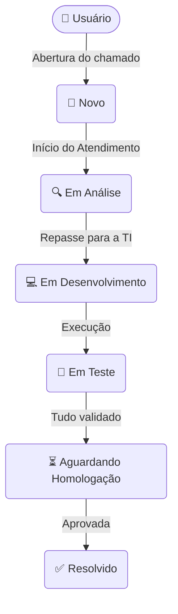
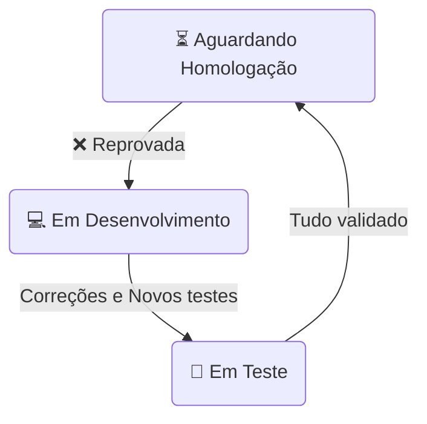

# ABA Desk 🏢

> **Central de Atendimento e Gestão do Ciclo de Vida de Sistemas**

---

## 📖 Sobre o projeto

O **ABA Desk** é uma plataforma corporativa interna criada para centralizar chamados, solicitações de melhorias, erros e demandas relacionadas aos sistemas utilizados pela empresa.

O objetivo principal é organizar todo o **ciclo de vida de uma demanda de TI em um único sistema**, garantindo que o chamado seja acompanhado desde sua abertura até sua resolução definitiva.

Mais do que apenas um "sistema de chamados", o ABA Desk atua como uma **plataforma completa de gestão do ciclo de vida de demandas de TI**, abrangendo as etapas de atendimento, análise técnica, desenvolvimento, execução de testes e homologação final com o usuário.

---

## 🎯 Problema que o ABA Desk resolve

Em ambientes corporativos dinâmicos, solicitações de TI podem chegar de forma desorganizada por diferentes canais (e-mail, chat, telefone), o que resulta na perda do histórico, falta de acompanhamento adequado e falhas de comunicação.

O ABA Desk resolve esse problema ao centralizar todo o processo. Com ele, é possível:

- 📝 Registrar chamados formalmente.
- 🗂️ Organizar as solicitações em uma fila unificada.
- 👤 Acompanhar responsáveis por cada etapa.
- 🚥 Controlar e definir níveis de prioridade.
- 💬 Registrar comentários e manter uma comunicação clara.
- ⏱️ Acompanhar o histórico completo das ações.
- 💻 Controlar o andamento do desenvolvimento das demandas.
- 🧪 Registrar formalmente casos de testes e seus resultados.
- ✅ Realizar homologações documentadas.
- 🔄 Controlar a aprovação ou reprovação da demanda.
- 🏁 Acompanhar a resolução efetiva do problema.

---

## 🔄 Fluxos do Sistema

### Fluxo Principal

O ciclo de vida "Caminho Feliz" de um chamado:

### Fluxo Alternativo (Reprovação)

Caso a funcionalidade entregue não esteja conforme o solicitado pelo usuário na fase de homologação:

---

## 👥 Tipos de Conta

O sistema possui três níveis de acesso e perfis de usuário:

### 1. Usuário
É o **solicitante**. Representa os colaboradores de todas as áreas da empresa.
**Permissões:**
- Abrir chamados.
- Visualizar e acompanhar os seus próprios chamados.
- Adicionar comentários e responder solicitações do TI.
- Realizar homologações (aceitar/rejeitar a entrega) quando for o responsável.

### 2. Atendente
É o responsável pelo **atendimento e gerenciamento** das demandas (Analista / Dev).
**Permissões:**
- Visualizar todos os chamados abertos na plataforma.
- Realizar a triagem e análise das solicitações.
- Atribuir responsáveis pelo ticket.
- Atuar ativamente no desenvolvimento (no MVP o Atendente engloba a função de desenvolvedor).
- Criar e registrar resultados de testes.
- Enviar as demandas finalizadas para a homologação.
- Acompanhar o fluxo completo e resolver chamados.

### 3. Administrador
Possui todas as permissões de um Atendente, com privilégios adicionais de **gestão**.
**Permissões:**
- Criar e editar dados de usuários.
- Ativar ou desativar contas de acesso.
- Alterar perfis e níveis de privilégio (User ↔ Attendant ↔ Admin).
- Visualizar informações administrativas globais.

---

## 🚥 Status dos Chamados

Cada chamado no ABA Desk reflete um momento específico do ciclo:

- 🆕 **Novo:** O chamado acabou de ser aberto pelo usuário e aguarda o primeiro atendimento.
- 🔍 **Em Análise:** O atendente está avaliando o escopo da solicitação para entender a necessidade.
- 💻 **Em Desenvolvimento:** Um responsável técnico (Atendente) está atuando ativamente no código/solução.
- 🧪 **Em Teste:** O desenvolvimento foi concluído e os casos de teste estão sendo executados para garantir a qualidade.
- ⏳ **Aguardando Homologação:** A demanda passou nos testes e aguarda a validação e o "de acordo" do responsável (usuário).
- ✅ **Resolvido:** O ciclo foi encerrado com sucesso. Nenhuma alteração de fluxo adicional é permitida.

---

## ✨ Principais Funcionalidades

### 🔐 Autenticação
- Login utilizando E-mail e Senha.
- Sessão segura baseada na autenticação por **JWT (JSON Web Token)**.

### 🎫 Gestão de Chamados
- Criação, listagem com filtros avançados e busca textual.
- Estrutura completa de paginação.
- Visualização de detalhes granulares (status, prioridade, responsável).
- Histórico imutável de ações ("Audit Trail").
- Thread de comentários centralizada.

### 💻 Desenvolvimento
- Controle de andamento da demanda e rastreabilidade direta identificando o responsável pelo código.

### 🧪 Casos de Teste (QA)
- Permite criar testes detalhados com *Resultado Esperado* e *Resultado Obtido*.
- Aprovação ou Reprovação item a item.
- **Regra de Negócio Crítica:** A demanda *somente* pode avançar para a fase de "Homologação" se possuir ao menos 1 caso de teste, e caso **todos** os testes criados estejam aprovados.

### ✅ Homologação
- Permite que o responsável do chamado (geralmente quem abriu) aprove ou rejeite a entrega.
- Caso aprovada: O ticket é marcado como **Resolvido**.
- Caso rejeitada: O ticket volta obrigatoriamente para **Em Desenvolvimento** e exige um comentário de justificativa.

### 📊 Dashboard
- Visão estratégica por meio de dashboards adaptativos de acordo com o perfil.
- **Usuários:** Visualizam métricas ativas atreladas aos seus próprios chamados.
- **Atendentes / Administradores:** Visualizam filas globais, desempenho do time de TI e taxas de resolução de tickets corporativos.
